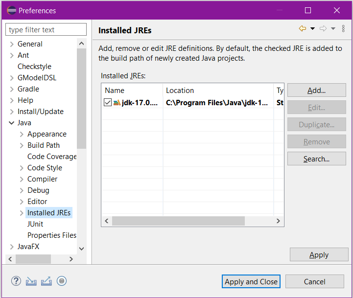
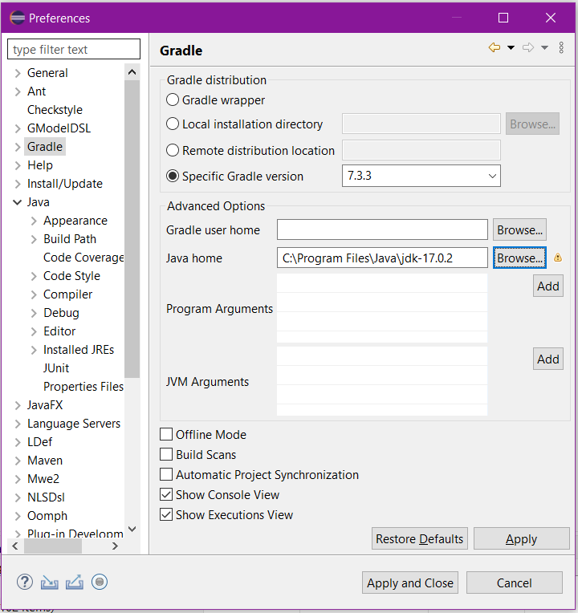
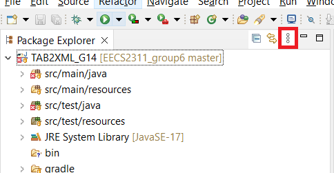
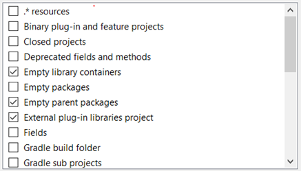
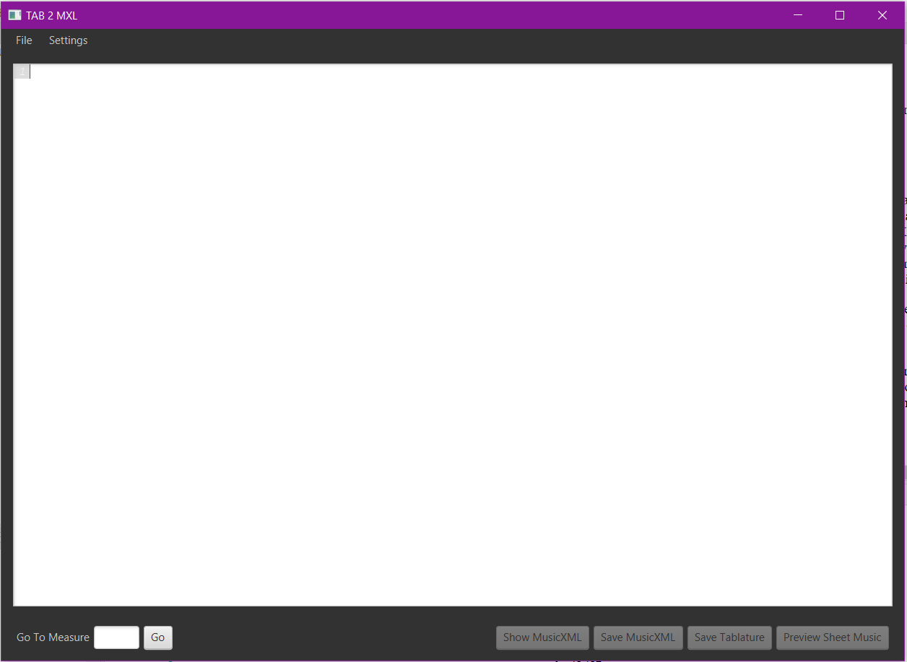
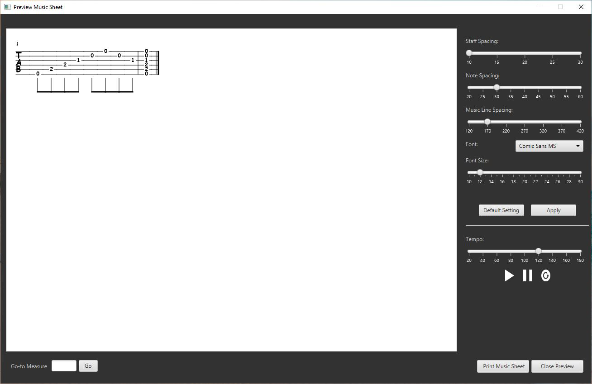
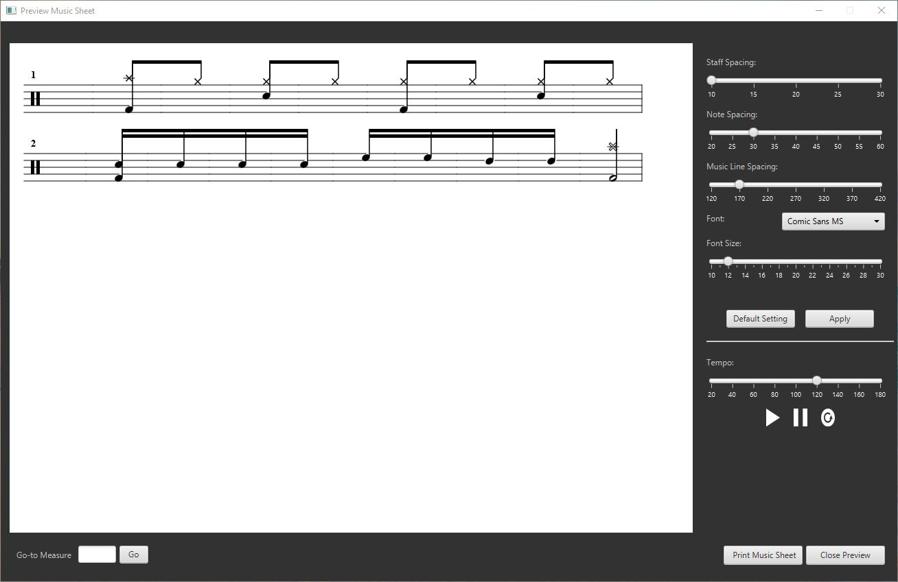

# TAB2XML
A Music application that converts a given music tablature into music score. 
## Description
TAB2XML is a Java application that converts music tablature into MusicXML, a file format 
that represents musical notation. However, reading a MusicXML file is a tedious task. 
The new update introduces the ability to preview any specific MusicXML file created from a 
given tablature into Music Scores for better understanding. 

Additionally, the new update includes two other features. Playing the notes 
(currently only for guitar tablature) and ability to print/save as Pdf. 

Currently, only guitar and drum tablature are supported, but more instruments and additional 
features, such as allowing the user to navigate to specific measures, will be added in future 
releases. 

### Intended Use

This application is intended to help both novice and expert music 
learners by allowing them to see a tablature in three different forms:
 tablature, music XML, and music sheet. 
 
## Getting Started

You can find the following instruction in addition to the Requirements document and testing 
documents under `Documents` folder in the repository. 

### Requirements
- Device: PC
- eclipse IDE
- Java JDK 17 (or higher)
- Gradle 7.3.3
- GitHub account
- Ability to log into GitHub account through eclipse

### Installing
To install this application you follow the steps noted below. Each 
steps is followed by their corresponding image to make the installation 
easier. Your can also watch the instruction video [here](https://youtu.be/e4EMPcAn35w)

 <ol>
  <li>
  	Open eclipse and create/ navigate to a new workspace. Click on launch: 	
  	

		
	

  </li>
  <li>
  	In the Package Explorer (usually on the left-hand side) select "Import projects" 
 	. You can also open the import window by clicking on File &#8594; import...	
 	

		
	

  </li>
  <li>
  	In the import window, select Git &#8594; Projects from Git. Click Next. 	
  	

		
	

  </li>
  <li>
  	Then select "Clone URI" &#8594; Next.	
  	

		
	

  </li>
  <li>
  	In the URI enter the following link:	
  	
 https://github.com/ElmiraOn/EECS2311_group6  
 
 	your import window should look like something like figure 5 with your username and password instead. 
 	(If your user name and password are not set up check the first lecture on how to access
 	 GitHub using eclipse). After double-checking the fields, click Next. 	
  	

		
	

  </li>
  <li>
  	In the next window, keep default and click Next again. 	
  	

		
	

  </li>
  <li>
  	Select the directory and click Next. 	
  	

		
	

  </li>
  <li>
  	Wait for the cloning process to finish. 
  </li>
  <li>
   	Keep the default and click Next. 	
   	

   		
	

  </li>
  <li>
  	Click Finish 	
  	

		
	

  </li>
  <li>
  	You should be able to see the application project displayed in Package Explorer. 	
  	

		
	

  </li>
 
</ol> 

 
### Executing the program

We Run this project through Gradle. To do this we need to open the "Gradle Task window" 
by Window &#8594; show view &#8594; others &#8594; search for the Gradle task in the search bar &#8594; open. 
It will take a while for Gradle to build the project. At the end, the project folder will
 be displayed in the Gradle Task window 

to run the application open Tab2XML_G14 &#8594; application &#8594; Run in the Gradle 
task window

## Help

When you open the project in the Gradle task window or run it for the first time, 
it is likely that you will face some errors. In this section we will discuss some 
methods you can try to fix these errors:

<ol>
	<li>
		Under Preferences &#8594; Java &#8594; Installed JREs make sure you have JRE 17	
		

			
		

	</li>
	<li>
		Under Preferences &#8594; Gradle selects Gradle Version 7.3.3 (or 7.1.1) and under 
		Advanced Options, point Java Home to JDK 17 by navigating to where you have stored 
		JDK17 
		

			
		

	</li>
	<li>
		In Eclipse Package Explorer, click on the three vertical dots. 
		

			
		

		select Filters, and uncheck the "resources", "Gradle build folder", and 
		"Gradle subprojects" so that they are visible 
		

			
		

	</li>
	<li>
		Right Click on the project &#8594; Gradle &#8594; Refresh Gradle Nature
	</li>
	<li>
		If there are still errors when running the project we suggest restarting the 
		eclipse	
	</li>
</ol>

## Using TAB2XML

The current version works only with the following two examples:

#### Guitar tab example:
<pre style="font-family:courier;">
|-----------0-----|-0---------------|
|---------0---0---|-0---------------|
|-------1-------1-|-1---------------|
|-----2-----------|-2---------------|
|---2-------------|-2---------------|
|-0---------------|-0---------------|
</pre>

#### Drum tab example: 
<pre style="font-family:courier;">
CC|x---------------|--------x-------|
HH|--x-x-x-x-x-x-x-|----------------|
SD|----o-------o---|oooo------------|
HT|----------------|----oo----------|
MT|----------------|------oo--------|
BD|o-------o-------|o-------o-------|
</pre>

#### Bass tab example: 
<pre style="font-family:courier;">
G|---------------|
D|-4-4-4-------4-|
A|------4----4---|
E|-------2-5-----|
</pre>

Additionally, you can use the following files under src/test/resources/system:

* `bendTest1.txt` (for Guitar)
* `capricho.txt` (for Guitar)
* `ex38.txt` (for Guitar)
* `graceTest1.txt` (for Guitar)
* `graceTest2.txt` (for Guitar)
* `money.txt` (for Bass)
* `parabola.txt` (for Drums)
* `push.txt` (for Drums)
* `repeat.txt` (for Drums)
* `restTest1.txt` (for Drums)
* `tieTest1.txt` (for Guitar)
* `timingTest1.txt` (for Drums)

### Instrument: Guitar

By entering the Guitar tablature from above, the system is able to:

1.	Properly convert it into a music sheet. 
2.	print the music sheet or save it as a PDF file in the print dialogue (currently only works once) 
3.	Play the notes and chord from beginning to end 
4.	Vertical scrolling for long measures
5.	By entering a measure number, highlight the corresponding measure on the screen
6.	Allow users to return to the input window and update the tablature without the need to close the current preview window.  

Unavailable functionalities: Pausing the playing capability

#### To preview the Guitar tablature:
<ol>
	<li>
		Run the application as noted in the previous section (Gradle task window &#8594; 
		application &#8594; run). This should open the main application window and you see 
		that buttons are disabled: 
		

			
		

	</li>
	<li>
		In the input area enter the guitar tablature from above by simply copy 
		pasting or save the tablature file as a .txt file and use File &#8594; open and 
		navigate to the location of the saved file:
		

			
		
 
		Entering the input in the correct format enables the buttons at the bottom. 
		You can use "Show MusicXML" and "Save MusicXML" to view and save the MusicXML 
		created using input tablature. For the purpose of this documentation, 
		we focus on the new update:previewing the music sheets. 		
	</li>
	<li> 
		Clicking on "Preview Sheet Music" opens a new window with a Music score 
		corresponding to the input tablature displayed on the screen.
		

			
		
 
		You can 3 buttons on the bottom right and a input field and a button on the 
		bottom left coreners allowing different functionalities:
	</li>
</ol>
	
<ul>
	<li>
		Playing the notes: Clicking on the "Play Notes" button plays the notes from 
		beginning to end. Pause and playing from the specific measure will be 
		available in future releases.  Please note that while the notes are being 
		played, the other functionalities are not usable.
	</li> 
	<li>
		Printing Music Sheet: Clicking on the "Print Music Sheet" button 
		opens a print dialogue window where you can either select to print 
		the music sheet using your preferred printer or save it as a PDF file.
		<ul>
			<li>
				Note: if you decide to save as PDF, keep in mind that the saved .pdf file 
				does not open automatically so make sure you take a note of the directory 
				you are saving to which you are saving the file. 
			</li>
		</ul>
	</li>
	<li>
		Navigating to specific measure: entering a specific measure number in the 
		input field in the bottom left corner and clicking on "Go" button will 
		highlight the specified measure in a red rectangle.
	</li>
	<li>
		Closing the preview window: by clicking on the close button or the `x` on 
		top right corner, you can close the preview window 
	</li>
</ul>

#### To update the tablature

to update the tablature simply select the input window (close/move/ minimize the 
current preview window), make the changes you want and click on the preview button
again to open a new preview window. You can compare the two music scores by having them 
open side by side. 

### Instrument: DrumSet

The Application support the same functionalities and features for Drumset as 
it does for the Guitar tablatures.

Following the same steps as the guitar example, but with the example drum tablature, this is the output:

	

 

For further details refer to `Documents/UserManual/EECS2311_Group6_TAB2XML_UserManual.pdf`.

### Instrument: Bass

The Application support the same functionalities and features for Bass as 
it does for the Guitar and DrumSet tablatures.

Following the same steps as the guitar example, but with the example bass tablature, this is the output:

	

 

For further details refer to `Documents/UserManual/EECS2311_Group6_TAB2XML_UserManual.pdf`.

## Authors

Group 6:

* Elmira Onagh
* Irsa Nasir
* Long Lin
* Harjap Randhawa
* Daniel Di Giovanni

## Version History

* version 0.0: the starter code
* version 0.1: the first prototype (maintained partial features)
* version 0.2: the mid-term submission (maintains the features from the requirements document and supports both drum and guitar tabs)

## License 

[![CC BY-SA 4.0][cc-by-sa-shield]][cc-by-sa]

This work is licensed under a
[Creative Commons Attribution-ShareAlike 4.0 International License][cc-by-sa].

[![CC BY-SA 4.0][cc-by-sa-image]][cc-by-sa]

[cc-by-sa]: http://creativecommons.org/licenses/by-sa/4.0/
[cc-by-sa-image]: https://licensebuttons.net/l/by-sa/4.0/88x31.png
[cc-by-sa-shield]: https://img.shields.io/badge/License-CC%20BY--SA%204.0-lightgrey.svg

## Acknowledgement

This work was possible because of following people:

* Professor  Vassilios Tzerpos who provided the starter code
* GROUP 14: Who made conversion of the tab to music xml possible
	* Stanley Ihesiulo
	* Alexander Arnold
	* Boho Kim
	* Kanwarjot Bharaj

