# TAB2XML
A Music application that converts a given music tablature into music score. 
## Description
TAB2XML is a Java application that converts music tablature into MusicXML, a file format 
that represents musical notation. However, reading a MusicXML file is a tedious task. 
The new update introduces the ability to preview any specific MusicXML file created from a 
given tablature into Music Scores for better understanding. 

Additionally, the new update includes two other features. Playing the notes 
(currently only for guitar tablature) and ability to print/save as Pdf. 

Currently, only guitar and drum tablature are supported, but more instruments and additional 
features, such as allowing the user to navigate to specific measures, will be added in future 
releases. 

### Intended Use

This application is intended to help both novice and expert music 
learners by allowing them to see a tablature in three different forms:
 tablature, music XML, and music sheet. 
 
## Getting Started

### Requirements
- Device: PC
- eclipse IDE
- Java JDK 17 (or higher)
- Gradle 7.3.3
- GitHub account
- Ability to log into GitHub account through eclipse

### Installing
To install this application you follow the steps noted below. Each 
steps is followed by their corresponding image to make the installation 
easier. Your can also watch the instruction video [here](link goes here)

1. Open eclipse and create/ navigate to a new workspace. 
Click on launch:

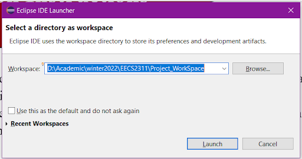

2.  In the Package Explorer (usually on the left-hand side) select “Import projects” 
 . You can also open the import window by clicking on File &#8594; import… 

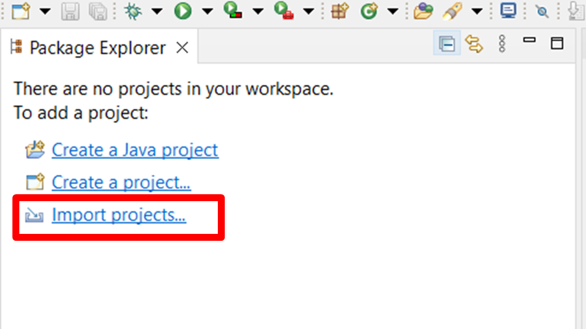

3. In the import window, select Git &#8594; Projects from Git. Click Next. 

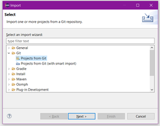

4. Then select “Clone URI” &#8594; Next.  

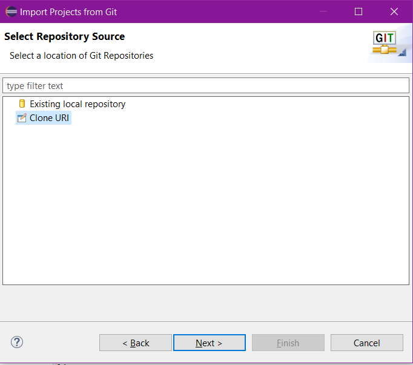

5. In the URI enter the following link: 
 https://github.com/ElmiraOn/EECS2311_group6  
 
 your import window should look like something like figure 5 with your username and password instead. 
 (If your user name and password are not set up check the first lecture on how to access
  GitHub using eclipse). After double-checking the fields, click Next. 

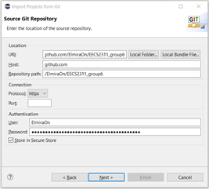

6. In the next window, keep default and click Next again. 

7. Select the directory and click Next. 

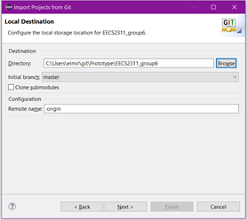

8. Wait for the cloning process to finish. 
9. Keep the default and click Next. 

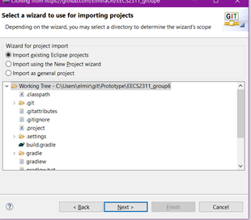

10. Click Finish 

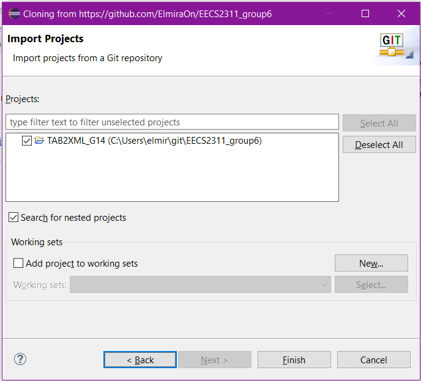

11. You should be able to see the application project displayed in Package Explorer. 

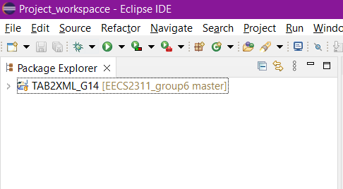

 
### Executing the program

We Run this project through Gradle. To do this we need to open the “Gradle Task window” 
by Window &#8594; show view &#8594; others &#8594; search for the Gradle task in the search bar &#8594; open. 
It will take a while for Gradle to build the project. At the end, the project folder will
 be displayed in the Gradle Task window 

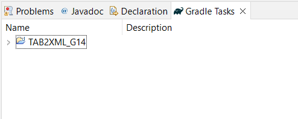

to run the application open Tab2XML_G14 &#8594; application &#8594; Run in the Gradle 
task window

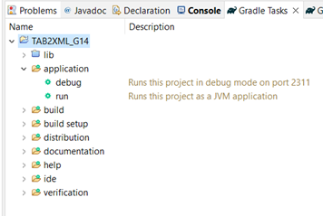

## Help
error handling

## Authors
## Version History

## License 

[![CC BY-SA 4.0][cc-by-sa-shield]][cc-by-sa]

This work is licensed under a
[Creative Commons Attribution-ShareAlike 4.0 International License][cc-by-sa].

[![CC BY-SA 4.0][cc-by-sa-image]][cc-by-sa]

[cc-by-sa]: http://creativecommons.org/licenses/by-sa/4.0/
[cc-by-sa-image]: https://licensebuttons.net/l/by-sa/4.0/88x31.png
[cc-by-sa-shield]: https://img.shields.io/badge/License-CC%20BY--SA%204.0-lightgrey.svg

## Acknowledgement